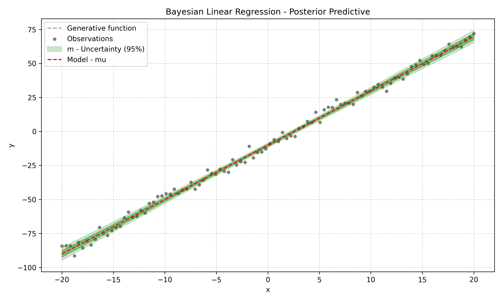

# Hardware Accelerator for a Bayesian Neuron

This project is a hardware implementation of a **Bayesian Neuron** written in SystemVerilog. It acts as a  probabilistic hardware accelerator that can be used as the fundamental building block (MAC node) for Bayesian Neural Networks (BNNs).

##  What is a Bayesian Neuron?
In a standard artificial neural network, a weight is just a fixed number (for example, w = 5). The network is always 100% confident in its calculation.

In a **Bayesian Neural Network**, weights are not fixed numbers. Instead, they are probability distributions. Every weight has a **mean** (the average value) and a **variance / uncertainty** (how unsure the network is about this weight). 


This project calculates a 1D Bayesian Linear Regression directly in hardware:
`y = (w * x) + bias` (where `w` is generated with random noise in every clock cycle).




---


##  How to Run the Project (Using Make)

This project includes a `Makefile` to fully automate the simulation and build process using Vivado. You don't need to open the Vivado GUI to verify the design.

### Available Commands:
* `make help` - Shows all available commands.
* `make sim TB=<testbench_name>` - Runs a specific testbench.
* `make build TOP=<module_name>` - Synthesizes the design and generates the bitstream.
* `make clean` - Deletes all temporary Vivado logs and folders.

---

##  Verification Steps

Please run the testbenches in the following order to understand the project:

### 1. Main Verification (Top-Level CRV)
This tests the entire system integration (math, data flow, and AXI-handshake) using Constrained Random Verification. It compares the hardware output against a software-calculated "Golden Model".
```bash
make sim TB=CRV_top_model
```

### 2. ALU Verification
This is to verify the Arithmetic Logic Unit:

```bash
make sim TB=tb_bnn_alu_crv
```

### 3. Application & Statistical Proof
The testbench demonstrates the application of the Bayesian Neuron. It sends the exact same input value into the hardware 100 times. It then calculates the Empirical Mean and Variance. The variance quantifies the uncertainty.

```bash
make sim TB=tb_bnn_statistics
```